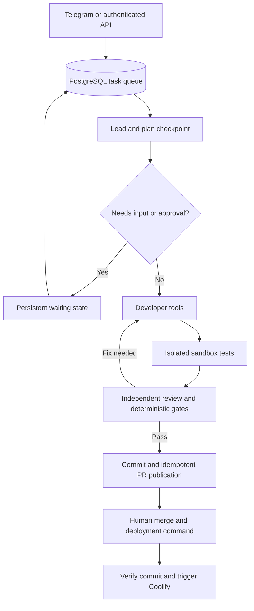

# Architecture and invariants

## Runtime

The control service runs FastAPI, one Telegram poller, and a worker pool. PostgreSQL owns the queue and evidence; workers are disposable. Default concurrency is one for the 12 GB ARM VPS. Workspace checkouts persist separately from the task database. A separate sandbox service receives only a bounded source snapshot and approved commands, never the control environment or Git checkout metadata.

## Queue and recovery

`tasks` extends the V0.1 schema without destroying rows. `task_events`, `task_artifacts` and `deployments` hold structured history. Startup DDL uses an advisory transaction lock on PostgreSQL; migration is idempotent. SQLite is for local development/tests; PostgreSQL is required for multi-worker operation.

Claims take a short PostgreSQL advisory transaction lock, then use row locking and a compare-and-set update. A second task for the same repository waits while the first has an active lease. Every update by a worker is fenced by its lease owner and expiry. Workers heartbeat during model calls and long tests. An expired task is requeued up to `MAX_RECOVERIES`; cancelled tasks remain cancelled. A shutdown/restart resumes at a durable stage boundary and can repeat development work in the preserved checkout, not at an exact model-token or tool-step boundary.

No force-push, reset, or deletion of an existing workspace occurs. New task branches are deterministic. A reviewed source digest and local commit SHA are saved **before** push. If the response is lost after a push or PR creation, a retry reconciles the branch/PR rather than recoding or opening duplicate PRs. A moved base, changed source, or closed/merged feedback PR stops publication.

## Trust boundaries

- Configuration is operator-owned; generated repository files cannot choose arbitrary repositories, models, network access or deployment targets.
- Telegram access requires explicit numeric user IDs and private chats. Per-task commands verify ownership. Legacy V0.1 tasks lack ownership metadata and remain visible through the operator API/database, not reassigned silently.
- Git uses temporary askpass with clean remote URLs, disabled hooks/global config and bounded subprocess duration. Tokens never enter the Git remote or command argument list.
- File tools reject traversal, Git internals, sensitive env/credential paths, symlinks and oversize files. Runtime database/log/cache files and recognizable credentials block publication.
- Command allowlists are a usability boundary, not a sandbox: pytest/npm can execute arbitrary source. Bubblewrap provides separate filesystem/PID/network/IPC/user namespaces; no control files, host checkout, Git metadata, Docker socket or control credentials are bound into the child.
- Runner container has no control secrets, DB credentials or workspace mount. It is non-root, capability-dropped, read-only and resource-limited. Its Docker seccomp/AppArmor exceptions permit namespace setup only on that runner. The child receives a fresh filesystem and cleared environment. No insecure execution fallback exists.
- Dependency download is an operator opt-in; wheel-only pip and npm with install scripts disabled get network during setup. Test commands always lose network. This does not make dependencies trustworthy: runtime tests still execute them inside the sandbox.
- Log redaction/pattern scans are defense in depth, not a guarantee against every credential format. Credentials belong in Coolify secrets, not requirements/source/docs.

## Completion evidence

Every iteration preserves plan, complete diff, structured command exits/timeouts, test-artifact checks, reviewer criteria mapping and deterministic gate results. Approval requires all fixed test commands to exit zero, no repository mutation/test artifacts, a nonempty complete diff, no known hygiene violations, one evidence record per criterion and zero unresolved reviewer issues. Pytest exit 5 (no tests) is failure.

The control workspace is hashed before/after sandbox testing and again immediately before commit. Untracked files are staged for the review diff and therefore cannot escape review. Review history is separate from developer conversation history.

## Deployment boundary

Generation and live release are distinct durable operations. A deployment request requires a human-provided full merged SHA, a PR whose head still equals the reviewed commit, identical reviewed/merged trees, current target branch SHA, successful existing GitHub checks and an explicitly registered Coolify app/repository/branch with auto-deploy disabled. The engine pins `git_commit_sha` and verifies it before submitting one deployment.

A lost deployment response becomes `unknown` and is not blindly retried. This prevents duplicate releases but requires operator reconciliation. A Coolify `finished` status is reported as such; it does not claim application acceptance or justify automated rollback of stateful data.

## Primary interface references

- Bubblewrap: https://github.com/containers/bubblewrap/blob/main/bwrap.xml
- SQLAlchemy locking: https://docs.sqlalchemy.org/en/20/core/selectable.html
- Coolify deploy: https://coolify.io/docs/api/endpoints/deployments/deploy-by-tag-or-uuid
- Coolify application configuration: https://coolify.io/docs/api/endpoints/applications/get-application-by-uuid
